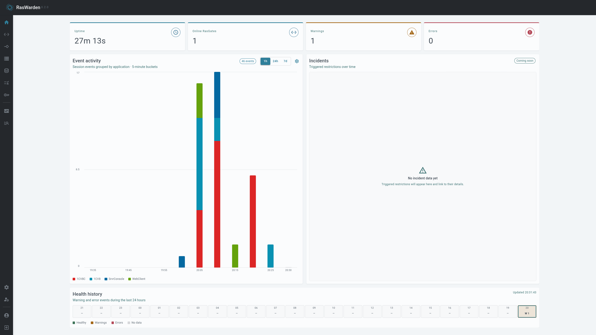
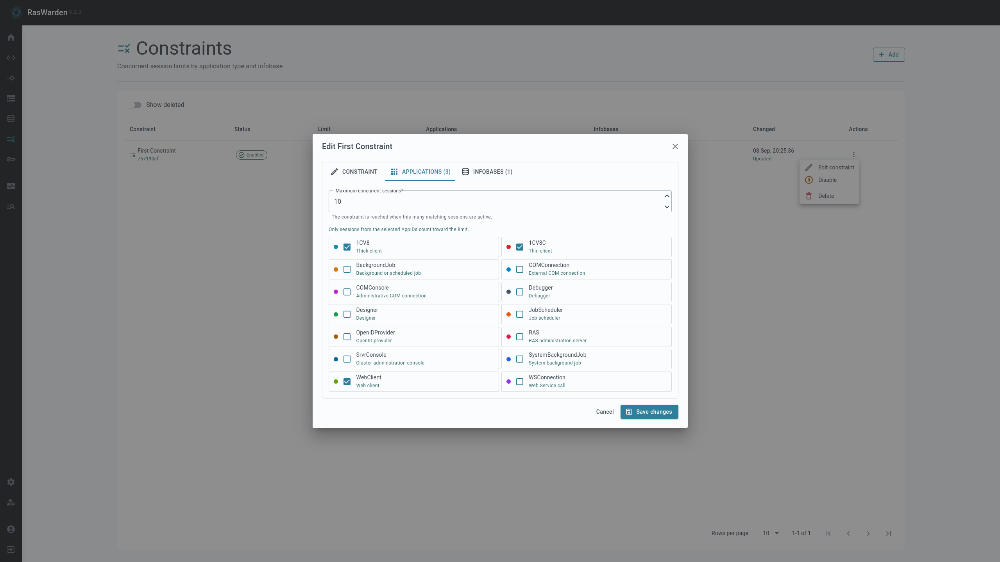

  <h1>Ras Ecosystem</h1>

  
  
    

  

    Tools and services for managing the RAS infrastructure of the 1C:Enterprise platform.
     
    <strong>English</strong> · <a href="./README.ru.md">Русский</a>
  

<table align="center" width="95%">
  <tbody>
    <tr>
      <td align="center" valign="top" width="50%">
        <strong>
          <a href="https://github.com/RasEcosystem/ras-studio-mono">RasStudio Mono</a>
        </strong>
          
        
          
        
        
        
          
        <strong>Desktop client.</strong> Provides an interface for administering RAS infrastructure
      </td>
      <td align="center" valign="top" width="50%">
        <strong>
          <a href="https://github.com/RasEcosystem/ras-hub">RasHub</a>
        </strong>
          
        
          
        
        
          
        <strong>Backend service.</strong> Provides an API and stores RAS infrastructure state
      </td>
    </tr>
  </tbody>
  <tbody>
    <tr>
      <td align="center" valign="top" colspan="2">
        <strong>RasWarden</strong>
          
        
        
          
        
        
          
        <strong>Session controller.</strong> Detects and automatically remediates violations of information base usage policies
      </td>
    </tr>
  </tbody>
  <tbody>
    <tr>
      <td align="center" valign="top" width="50%">
        <strong>
          <a href="https://github.com/RasEcosystem/ras-gate">RasGate</a>
        </strong>
          
        
        
          
        <strong>Management gateway.</strong> Connects ecosystem components to 1C:Enterprise servers
      </td>
      <td align="center" valign="top" width="50%">
        <strong>RasEventGate</strong>
          
        
        
          
        <strong>Event gateway.</strong> Notifies components and external systems about server events
      </td>
    </tr>
  </tbody>
</table>
