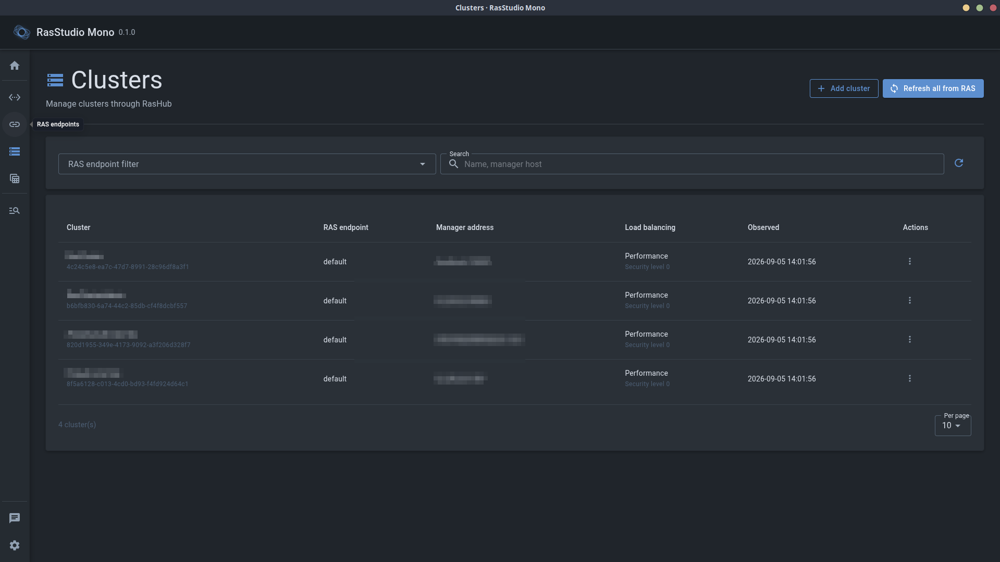
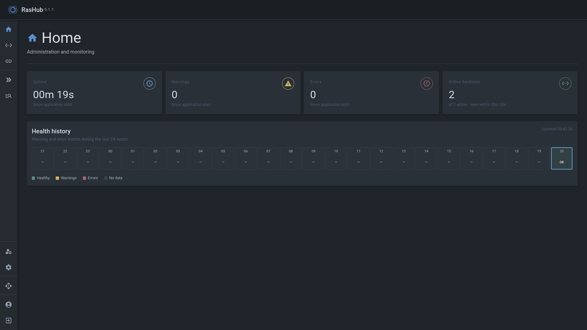
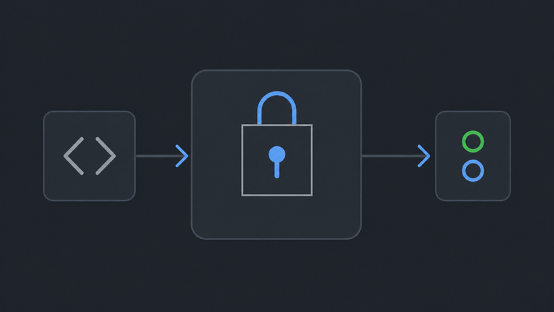
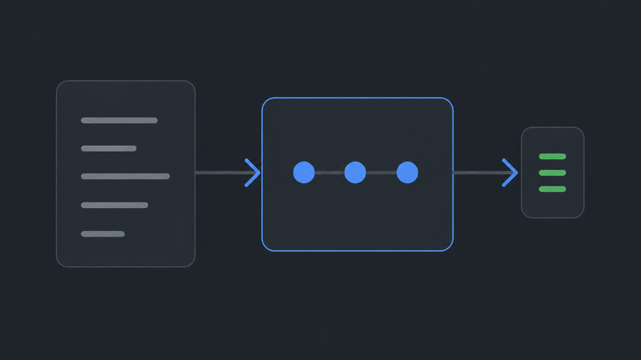
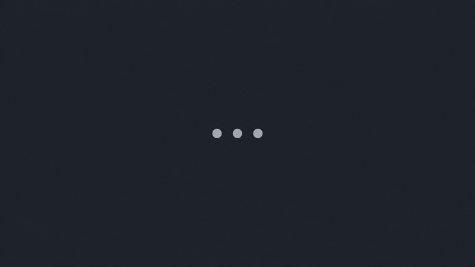

  <h1>Ras Ecosystem</h1>

  
  

  

    Инструменты и сервисы для управления RAS-инфраструктурой платформы 1С:Предприятие.
     
    <a href="./README.md">English</a> · <strong>Русский</strong>
  

<table align="center" width="95%">
  <tbody>
    <tr>
      <td align="center" valign="top" width="50%">
        
         
        <strong>
          <a href="https://github.com/RasEcosystem/ras-studio-mono">RasStudio Mono</a>
        </strong>
          
        
        
        
          
        <strong>Десктоп-клиент.</strong> Предоставляет интерфейс для администрирования RAS-инфраструктуры
      </td>
      <td align="center" valign="top" width="50%">
        
         
        <strong>
          <a href="https://github.com/RasEcosystem/ras-hub">RasHub</a>
        </strong>
          
        
        
          
        <strong>Бэкенд-сервис.</strong> Предоставляет API и хранит состояние инфраструктуры RAS
      </td>
    </tr>
    <tr>
      <td align="center" valign="top" width="50%">
        
         
        <strong>
          <a href="https://github.com/RasEcosystem/ras-gate">RasGate</a>
        </strong>
          
        
        
          
        <strong>Шлюз управления.</strong> Связывает компоненты экосистемы с серверами 1С:Предприятия
      </td>
      <td align="center" valign="top" width="50%">
        
         
        <strong>RasEventGate</strong>
          
        
        
          
        <strong>Шлюз событий.</strong> Уведомляет компоненты и внешние системы о событиях на сервере
      </td>
    </tr>
    <tr>
      <td align="center" valign="top" colspan="2">
        
         
        <strong>RasWarden</strong>
          
        
        
          
        <strong>Контроллер сеансов.</strong> Выявляет и автоматически устраняет нарушения политик использования информационных баз
      </td>
    </tr>
  </tbody>
</table>
